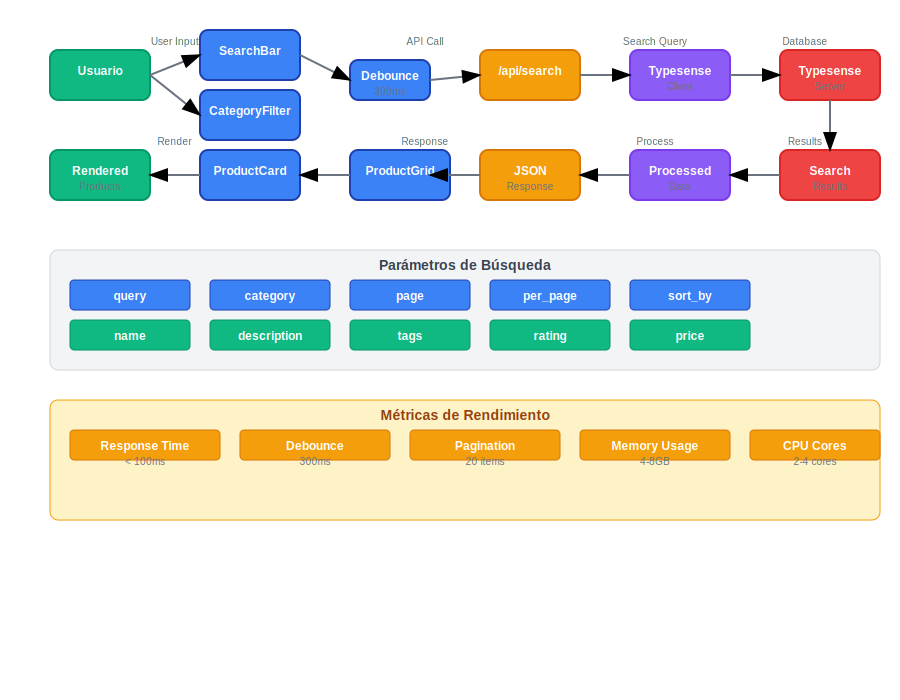

# Typesense E-commerce Search Platform

### Características Destacadas
- ⚡ **Búsqueda en tiempo real** con debouncing de 300ms
- 🔍 **Búsqueda semántica** en múltiples campos
- 🏷️ **Filtrado por categorías** (electronics, clothing, books, home, sports)

### Métricas de Rendimiento
- **Tiempo de respuesta**: < 100ms
- **Memoria asignada**: 4-8GB
- **CPU**: 2-4 cores
- **Puerto**: 8108 (Typesense)

## Arquitectura del Sistema



## Flujo de Datos

El siguiente diagrama muestra el flujo completo de datos desde la entrada del usuario hasta la renderización de resultados:



### Componentes del Flujo:

1. **Usuario** → Ingresa términos de búsqueda o selecciona categorías
2. **SearchBar/CategoryFilter** → Componentes de UI que capturan la entrada
3. **Debounce (300ms)** → Optimización para evitar llamadas excesivas a la API
4. **API Routes** → `/api/search` y `/api/categories` procesan las solicitudes
5. **Typesense Client** → Cliente que comunica con el servidor de búsqueda
6. **Typesense Server** → Motor de búsqueda que procesa las consultas
7. **ProductGrid/ProductCard** → Componentes que renderizan los resultados

### Parámetros de Búsqueda:
- `query`: Término de búsqueda
- `category`: Filtro por categoría
- `page`: Número de página
- `per_page`: Elementos por página
- `sort_by`: Criterio de ordenamiento

### Métricas de Rendimiento:
- **Tiempo de respuesta**: < 100ms
- **Debounce**: 300ms
- **Paginación**: 20 elementos por página
- **Memoria**: 4-8GB
- **CPU**: 2-4 cores


## Características Principales

### Funcionalidades de Búsqueda
- **Búsqueda en tiempo real** con debouncing
- **Filtrado por categorías** (electronics, clothing, books, home, sports)
- **Búsqueda semántica** en nombre, descripción y tags
- **Ordenamiento inteligente** por relevancia y rating
- **Paginación** con resultados por página configurables


## Estructura del Proyecto

```
typesense-ecommerce/
├── app/                    # Next.js App Router
│   ├── api/               # API Routes
│   │   ├── categories/    # Endpoint categorías
│   │   └── search/        # Endpoint búsqueda
│   ├── globals.css        # Estilos globales
│   ├── layout.tsx         # Layout principal
│   └── page.tsx           # Página principal
├── components/            # Componentes React
│   ├── ui/               # Componentes UI base
│   ├── category-filter.tsx
│   ├── product-card.tsx
│   ├── product-grid.tsx
│   └── search-bar.tsx
├── lib/                  # Utilidades y configuración
│   ├── types.ts          # Tipos TypeScript
│   ├── typesense.ts      # Cliente Typesense
│   └── utils.ts          # Utilidades
├── scripts/              # Scripts de utilidad
│   ├── explore-db.js     # Explorar base de datos
│   └── seed-large-dataset.js
└── docker-compose.yml    # Configuración Docker
```

## Configuración e instalación

### Prerrequisitos
- Node.js 18+
- Docker y Docker Compose

### 1. Clonar el repositorio
```bash
git clone <repository-url>
cd typesense-ecommerce
```

### 2. Instalar dependencias
```bash
npm install
```

### 3. Configurar variables de entorno
```bash
cp .env.example .env.local
```

Variables de entorno necesarias:
```env
TYPESENSE_API_KEY=xyz
TYPESENSE_HOST=localhost
TYPESENSE_PORT=8108
TYPESENSE_PROTOCOL=http
```

### 4. Iniciar Typesense con Docker
```bash
docker-compose up -d
```

### 5. Ejecutar el proyecto
```bash
npm run dev
```

La aplicación estará disponible en `http://localhost:3000`


## Características de Productos

### Estructura de Datos
```typescript
interface Product {
  id: string
  name: string
  description: string
  price: number
  originalPrice: number
  discount: number
  category: string
  image: string
  rating: number
  reviews: number
  stock: number
  tags: string[]
}
```

### Categorías Disponibles
- **Electronics**: Smartphones, laptops, auriculares
- **Clothing**: Camisetas, jeans, ropa casual
- **Books**: Literatura, estrategia, negocios
- **Home**: Lámparas, decoración
- **Sports**: Zapatillas, equipamiento deportivo

## 🐳 Configuración Docker

### Recursos Asignados
- **Memoria**: 8GB límite, 4GB reservada
- **CPU**: 4 cores límite, 2 cores reservados
- **Puerto**: 8108
- **Persistencia**: Volumen Docker para datos

### Health Check
```yaml
healthcheck:
  test: ["CMD", "curl", "-f", "http://localhost:8108/health"]
  interval: 30s
  timeout: 10s
  retries: 3
  start_period: 60s
```

## Scripts de Utilidad

### Explorar Base de Datos
```bash
node scripts/explore-db.js
```

### Generar Dataset Grande
```bash
node scripts/seed-large-dataset.js generate <number_of_products>
```

## Comandos Disponibles

```bash
npm run dev      # Desarrollo local
npm run build    # Build de producción
npm run start    # Servidor de producción
npm run lint     # Linting
```
